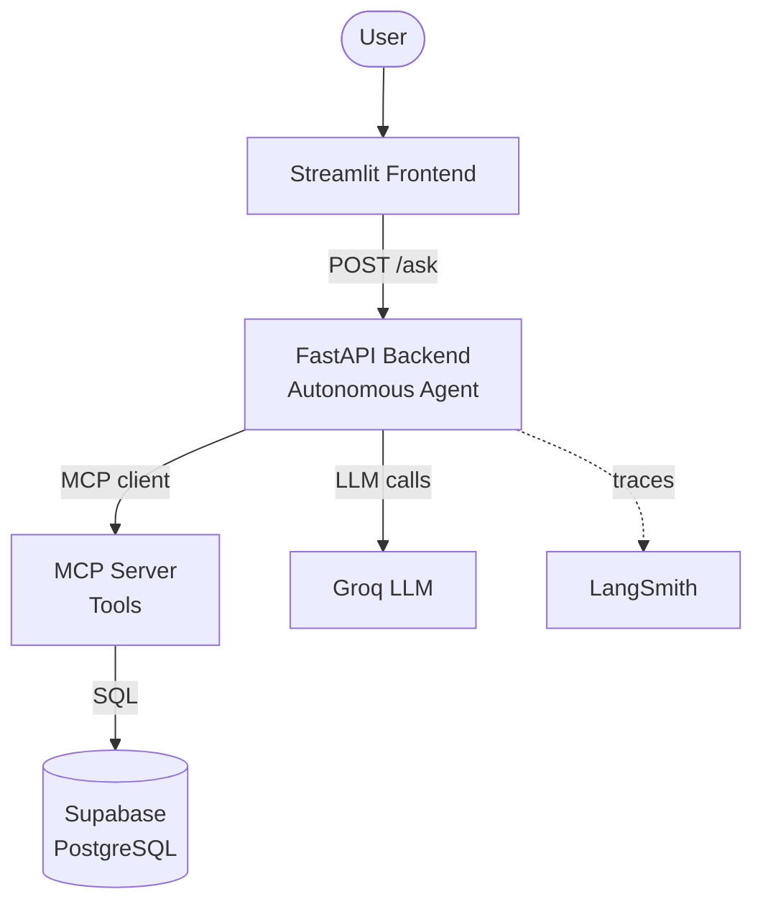

# DataMind v2 🧠 — Autonomous AI Data Analyst

Ask questions in plain English about **100,000+ real e-commerce orders** — an autonomous AI agent inspects the database, writes its own SQL, runs it, and even decides how to visualize the answer.

**🔗 Live Demo:** [Streamlit App](https://datamind-v2-veku2auid6f8lxx2zxjvvv.streamlit.app/) · [Backend API](https://datamind-backend-lo79.onrender.com/docs)

---

## The Problem

Most people who need answers from data can't write SQL. DataMind v2 bridges that gap: anyone can ask a question in plain English and get an accurate, data-backed answer (with a chart) from a real e-commerce database — powered by an autonomous agent, not a fixed script.

## Architecture

Three decoupled services, each independently deployed:



- **Frontend** (Streamlit) → calls the backend
- **Backend** (FastAPI) → runs the autonomous agent; acts as an **MCP client**
- **MCP Server** (FastMCP) → exposes the tools + holds the database connection
- Each layer only talks to the next — clean, reusable separation.

## Key Features

- 🧠 **Autonomous agent** — a ReAct loop that decides its own steps: inspects the schema, writes its own SQL (including JOINs), runs it, and self-corrects on errors. No fixed pipeline.
- 🔌 **Model Context Protocol (MCP)** — tools live in a standalone MCP server, so any agent or app can reuse them. Reusable tool infrastructure, not hardcoded functions.
- 🛡️ **Guardrails** — read-only enforcement (SELECT-only) and blocked access to sensitive tables, applied at the tool layer.
- 🔍 **Observability** — every agent step (LLM calls + tool calls, with inputs, outputs, tokens, latency) is traced in **LangSmith**.
- 📊 **Evals** — an automated test suite scores the agent against known-answer questions, catching regressions across the whole stack.
- 📈 **Smart visualization** — the agent decides when to chart and picks the type (bar / line / pie).

## Tech Stack

| Layer | Tech |
|---|---|
| Agent / LLM | LangChain, Groq (`gpt-oss-120b`) |
| Tool protocol | MCP (FastMCP) |
| Backend | FastAPI + Uvicorn |
| Frontend | Streamlit |
| Database | PostgreSQL (Supabase) |
| Observability | LangSmith |
| Deployment | Render (MCP server + backend), Streamlit Cloud (frontend) |

## Dataset

Olist Brazilian E-Commerce — **100,000+ real orders** across customers, order items, products, and payments.

## How It Works

1. User asks a question in the Streamlit UI.
2. The frontend calls the backend's `/ask` API.
3. The backend runs an **autonomous agent** that connects to the MCP server as a client and loads its tools.
4. The agent inspects the schema, writes SQL, runs it via MCP tools, and decides whether to visualize.
5. **Guardrails** block unsafe queries; every step is **traced** in LangSmith.
6. The answer (and chart data) flow back to the UI.

## Screenshots

**Plain-English question → a data-backed answer**


**The agent decides to visualize — a chart it drew on its own**


**Observability — every agent step traced in LangSmith (inputs, outputs, tokens, latency)**


## Evolution: v1 → v2

DataMind **v1** was a *scripted pipeline* — fixed steps, no decisions. **v2** rebuilds it as a *truly autonomous agent* with MCP, guardrails, observability, and evals — the same product, re-engineered from a pipeline into an autonomous system.

## Local Development

```bash
# 1. MCP server
cd mcp_server && pip install -r requirements.txt && python server.py

# 2. Backend (new terminal)
cd backend && pip install -r requirements.txt && uvicorn main:app --port 8001

# 3. Frontend (new terminal)
cd frontend && pip install -r requirements.txt && streamlit run app.py
```
*(Each folder uses a `.env` for secrets — see `.env` examples.)*
